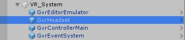

# HawkHunterVR
> ### 목차
### [기획](#기획)
- [팀원 내 역할](#팀원-내-역할)
- [개발 환경](#개발-환경)
- [최종 결과물](#최종-결과물)
- [성과](#성과)

### [프로토타입](#프로토타입)
- [요구사항](#요구사항)
- [스케치 및 요구사항](#스케치-및-요구사항)

### [유저 컨트롤](#유저-컨트롤)
- [카메라 컨트롤](#카메라-컨트롤)
- [VR 컨트롤러](#vr-컨트롤러)
- [레이케스터 컨트롤러](#레이케스터-컨트롤러)

### [게임 로직](#게임-로직)
- [시작과 끝](#시작과-끝)
- [몬스터 리스폰](#몬스터-리스폰)
- [데미지 팝업 효과](#데미지-팝업-효과)

### [VFX](#)

<br><br>
<br><br>


# 기획
> ### 팀원 내 역할
- 총 팀원 3명 중 기획, `클라이언트 프로그래머`, FX담당

<br>

> ### 개발 환경
- 2019.08 ~ 2019.10 4학년 2학기 과제물
- Unity 2018.2.9f1
- `Google CargoBoard`

<br>

> ### 최종결과물
- `HawkHunter.apk` 로 직접 실행해 보실 수 있습니다.
- https://www.dropbox.com/s/np8l6ie19nqbum9/HawkHunter.apk?dl=0


<br>

> ### 성과
- Unity Particle System에 전반적인 사용법 학습.
- `Google VR Kit` 사용법 및 실습.

<br><br>
<br><br>


# 프로토타입
> ### 요구사항
- 모바일에 적합한 UI 및 리소스 사용.
- 모바일에 적합한 간단한 게임 루프
- GoogleVR에 적합한 `원터치` 게임을 기획

<br>

> ### 스케치 및 요구사항


1. [게임시작] 메뉴판 띄우기
2. 해당 라운드 및 목표, 장전 표시
3. 게임 시작 시 랜덤한 지역에서 몬스터 리젠
4. 총 8발로 목표물 최대치 제거
5. 결과 보여주기

<br><br>
<br><br>


# 유저 컨트롤
> ### 카메라 컨트롤


- `Gvr Pointer Physics Raycaster`
    - Raycater Event Mask : 레이케스터 이벤트가 발동될 레이어마스크를 선택합니다.
    - Max Raycast Hits : 레이케스트 최대 충돌 횟수
- `kim_RecticlePointer : GvrBasePointer` : 플레이어의 입력을 처리합니다.


```C#
// Gvr Pointer Physics Raycaster
// GoogleVR_API
protected override bool PerformRaycast(GvrBasePointer.PointerRay pointerRay,
                                        float radius,
                                        PointerEventData eventData,
                                        List<RaycastResult> resultAppendList)
    ...
    
    Array.Sort(hits, 0, numHits, hitComparer);

    for (int i = 0; i < numHits; ++i)
    {
        Vector3 projection =
            Vector3.Project(hits[i].point - pointerRay.ray.origin, pointerRay.ray.direction);
        Vector3 hitPosition = projection + pointerRay.ray.origin;
        float resultDistance = hits[i].distance + pointerRay.distanceFromStart;

        Transform pointerTransform =
            GvrPointerInputModule.Pointer.PointerTransform;
        float delta = (hitPosition - pointerTransform.position).magnitude;
        if (delta < pointerRay.distanceFromStart)
        {
            continue;
        }

        RaycastResult result = new RaycastResult
        {
            gameObject = hits[i].collider.gameObject,
            module = this,
            distance = resultDistance,
            worldPosition = hitPosition,
            worldNormal = hits[i].normal,
            screenPosition = eventCamera.WorldToScreenPoint(hitPosition),
            index = resultAppendList.Count,
            sortingLayer = 0,
            sortingOrder = 0
        };

        resultAppendList.Add(result);
    }

    return true;
}
```


- 레이케스트에 충돌한 오브젝트의 위치와 데이터들을 가져옵니다.
```c#
//kim_RecticlePointer
    public override void OnPointerClickDown(GameObject Target = null) //화면 터치 시
    {
        bool isBulletAvailable = transform.root.GetComponentInChildren<OBJ_Shotgun>().Shot();
        if (!isBulletAvailable) return;
        m_crosshair.GetComponent<UnityEngine.UI.Image>().color = Color.gray;
        List<Eagle_Prefab> hitedEagle = new List<Eagle_Prefab>();
        for (var i = 0; i < 30; i++)
        {
            var v3Offset = Camera.main.transform.up * Random.Range(10f, 60.0f);
            v3Offset = Quaternion.AngleAxis(Random.Range(0.0f, 360.0f), Camera.main.transform.forward) * v3Offset;
            var v3Hit = Camera.main.transform.forward * 1000 + v3Offset;
            DrawLine(transform.root.GetComponentInChildren<OBJ_Shotgun>().FireOut.position + v3Hit.normalized * 5, v3Hit, Color.yellow);
            RaycastHit hit;
            Ray ray = new Ray(Camera.main.transform.position, v3Hit);
            if (Physics.Raycast(ray, out hit, 1000))
                if (hit.collider != null)
                    if (hit.collider.gameObject.CompareTag("Monster"))
                    {
                        if (hit.collider.gameObject.GetComponent<Eagle_Prefab>().isAlive)
                        {
                            hit.collider.gameObject.GetComponent<Eagle_Prefab>().totalDamage += 30;
                            hitedEagle.Add(hit.collider.gameObject.GetComponent<Eagle_Prefab>());
                            showCrosshairTime = 0.3f;
                        }
                    }
        }
```
- `OnPointerClickDown()`, `OnPointerClickUp()`등에 대한 로직을 수행합니다.
- 샷건의 산발적 궤도를 그리기 위해 메인 Pointer 주위로 여러 가닥의 라인을 그립니다.
- 레이케스트 대상의 스크립트별 처리를 달리합니다.

<br>

> ### VR 컨트롤러

- `GvrEditorEmulator` : 에디터에서 빌드 시 컨트롤러를 도와줍니다.
- `GvrHeadser` : 메인 카메라를 Gvr로 초기화시킵다.
- `GvrControllerMain`
    - `GvrControllerInput` : 기본 컨트롤러 이벤트를 처리합니다.
- `GvrEventSystem` 
    - `GvrPointerInputModule` : 레이케스터로 해당되는 EventSystem의 모듈들(Button 등을)처리합니다.


```C#
//GvrControllerInput
    public static bool TouchDown
    {
        get
        {
            if (instances.Length == 0)
            {
                return false;
            }
            return instances[0].GetButtonDown(GvrControllerButton.TouchPadTouch);
        }
    }
```

<br>

> ### 레이케스터 컨트롤
- 특정 오브젝트 태그가 `Monster`이면 레이케스터 충돌시 Overlay된 원형 실린더가 확대 됨
- 특정 오브젝트 태그에 `Monster`이면 레이케스터 비충돌시 점 상태가 됨


```c#
//GvrPointerInputModuleImpl
    private void UpdatePointer(GameObject previousObject)
    {
        if (CurrentEventData == null)
        {
            return;
        }

        GameObject currentObject = GetCurrentGameObject(); // Get the pointer target
        bool isPointerActiveAndAvailable = IsPointerActiveAndAvailable();

        bool isInteractive = CurrentEventData.pointerPress != null ||
                             EventExecutor.GetEventHandler<IPointerClickHandler>(currentObject) != null ||
                             EventExecutor.GetEventHandler<IDragHandler>(currentObject) != null;

        //수정
        if(currentObject!=null)
        if(currentObject.CompareTag("Monster")){ // 해당 태그
            isInteractive = true;
        }

        if (isPointerHovering && currentObject != null && currentObject == previousObject)
        {
            if (isPointerActiveAndAvailable)
            {
                Pointer.OnPointerHover(CurrentEventData.pointerCurrentRaycast, isInteractive);
            }
        }
```


```c#
//kim_RecticlePointer
//크로스헤어와 기본 엑티브 실린더를 스위치 합니다.
    private void Update()
    {
        UpdateDiameters();
        if (showCrosshairTime > 0) //수정
        {
            if (GetComponent<MeshRenderer>().enabled) { GetComponent<MeshRenderer>().enabled = false; }
            if (!m_crosshair.activeSelf) { m_crosshair.SetActive(true); }
            showCrosshairTime -= Time.deltaTime;
            if (showCrosshairTime <= 0)
                showCrosshairTime = 0;
        }
        else
        {
            if (!GetComponent<MeshRenderer>().enabled) { GetComponent<MeshRenderer>().enabled = true; }
            if (m_crosshair.activeSelf) { m_crosshair.SetActive(false); }
        }
    }
```

<br><br>
<br><br>


# 게임 로직
> ### 시작과 끝
- `GameManager_Hunter` : 게임 로직을 수행합니다.


```c#
    private void SetRound()
    {
        VOICE_Radio_Get_Ready.Play();
        switch (GameManager_Hunter.Round)
        {
            case 1:
                m_round = "Round 1";
                maxEagleGoal = GameManager_Hunter.Goal = 5;
                m_timer = 12;
                maxEagleAmound = 10;
                break;
            case 2:
                m_round = "Round 2";
                maxEagleGoal = GameManager_Hunter.Goal = 7;
                m_timer = 12;
                maxEagleAmound = 20;
                break;
            case 3:
                m_round = "Round 3";
                maxEagleGoal = GameManager_Hunter.Goal = 10;
                m_timer = 12;
                maxEagleAmound = 30;
                break;
        }
        StageScene.GetComponent<UI_StageSelect>().Initialize();
        FindObjectOfType<OBJ_Shotgun>().Reload();
        StartCoroutine(SetStageTimer());
        switch (GameManager_Hunter.Round)
        {
            case 1:
                maxEagleAmound -= repawnPositions[Random.Range(0, 3)].Respawn(maxEagleAmound);
                break;
            case 2:
                maxEagleAmound -= repawnPositions[Random.Range(0, 3)].Respawn(Random.Range(1, maxEagleAmound / 2));
                maxEagleAmound -= repawnPositions[Random.Range(0, 3)].Respawn(maxEagleAmound);
                break;
            case 3:
                maxEagleAmound -= repawnPositions[Random.Range(0, 3)].Respawn(Random.Range(1, maxEagleAmound / 3));
                maxEagleAmound -= repawnPositions[Random.Range(0, 3)].Respawn(Random.Range(1, maxEagleAmound / 3));
                maxEagleAmound -= repawnPositions[Random.Range(0, 3)].Respawn(maxEagleAmound);
                break;
        }
    }
```
- 레벨별 속성을 달리하였습니다.


```c#
//GameManager_Hunter
    IEnumerator GetReadyNexyStage(float time = 0)
    {
        yield return new WaitForSeconds(time);
        if (++GameManager_Hunter.Round > 3)
        {
            SwitchScene(RankingScene);
            FindObjectOfType<RankManager>().RankInput(Score);
            FindObjectOfType<RankManager>().My_Score.text = Score.ToString();

        }
        else
        {
            SwitchScene(StageScene);
        }
    }
```
- Title Scene -> Stage Scene -> Result Scene -> Ranking Scene  순으로
- Round가 3번 반복될 때 까지 Stage Scene -> Result Scene 이 반복됩니다.

<br>

> ### 몬스터 리스폰
게임이 시작되면
- 3개의 지역에서 랜덤으로 리스폰 합니다.
- 방향과 속도는 기준치 범위 안에서 랜덤으로 적용됩니다.
- Round2 부터는 `KingEagle`과 `SpinEagle`이 랜덤으로 스폰됩니다.


```c#
//Eagle_RespwanManager
        while (amount != 0)
        {
            Destroy(Instantiate(Eagle_prefab, transform.position, transform.rotation), lifeTime);
            amount--;
            if (GameManager_Hunter.Round > 1)
            {
                if (Random.value > 0.9f)
                {
                    Destroy(Instantiate(KingEagle_prefab, transform.position, transform.rotation), lifeTime);
                    continue;
                }
                if (Random.value > 0.9f)
                {
                    Destroy(Instantiate(SpinEagle_prefab, transform.position, transform.rotation), lifeTime);
                    continue;
                }
            }
        }
```
- 매개변수로 주어진 `매의 수`에 따라 리스폰 시키는 매의 수와 종류를 달리 합니다.
   


- `Nomal_Eagle` 체력: 100, 속도 18~29, 점수 1000
- `King_Ealge` 체력: 160, 속도 28~39, 점수 1500 ( 1초 마다 방향전환 )
- `Spin_Eagle` 체력: 100, 속도 18~29, 점수 1500 ( 큰 원을 그리며 올라갑니다)


<br>

## 데미지 팝업 효과
- `DamagePopupManager` : 적 적중시 데미지를 캔버스에 출력합니다.


```c#
//DamagePopupManager
using System.Collections;
using System.Collections.Generic;
using UnityEngine;

public class DamagePopupManager : MonoBehaviour
{
    public GameObject DamagePopup_Prefab;
    public Transform ScreenSpace_Canvas;
    public void DamegePopup(Vector3 Position, int Damage = 0)
    {
        GameObject Dp = Instantiate(DamagePopup_Prefab, ScreenSpace_Canvas.transform);
        Dp.GetComponentInChildren<UnityEngine.UI.Text>().text = Damage.ToString();
        Dp.transform.position = Camera.main.WorldToScreenPoint(Position);

        Vector2 adjustedPosition = Camera.main.WorldToScreenPoint(Position);
        adjustedPosition.x *= ScreenSpace_Canvas.GetComponent<RectTransform>().rect.width / (float)Camera.main.pixelWidth;
        adjustedPosition.y *= ScreenSpace_Canvas.GetComponent<RectTransform>().rect.height / (float)Camera.main.pixelHeight;
        Dp.transform.localPosition = adjustedPosition - ScreenSpace_Canvas.GetComponent<RectTransform>().sizeDelta / 2f;
        Dp.transform.localPosition = new Vector3(Dp.transform.position.x,Dp.transform.position.y,0);


        if (Damage >= 100)
        {
            Dp.GetComponentInChildren<UnityEngine.UI.Text>().color = Color.red;
            Dp.GetComponentInChildren<UnityEngine.UI.Image>().color = Color.yellow;
            Dp.GetComponentInChildren<Animator>().SetTrigger("Critical");
            Dp.transform.localScale *= 1.1f;
        }
        else if (Damage > 60)
        {
            Dp.GetComponentInChildren<UnityEngine.UI.Text>().color = Color.red;
            Dp.GetComponentInChildren<Animator>().SetTrigger("Critical");
        }
        Destroy(Dp,0.2f);
    }
}
```
- 데미지별 효과를 달리하였습니다.
- 데미지 60 이상은 빨강색 크로스헤어
- 데미지 100 이상은 큰 빨강색 크로스헤어
- 나머지는 노란색 크로스헤어를 주었습니다.
```c#
//Eagle_Prefab
    public void GetShot (int Damage = 20) {
        if (Damage <= 0) return;
        FindObjectOfType<DamagePopupManager> ().DamegePopup (transform.position, Damage);
        GameManager_Hunter.Score += Damage * 2;
        totalDamage = 0;
        if (isAlive) {
            Destroy (Instantiate (FX_Hit, transform.position, transform.rotation), 1.0f);
            hp -= Damage;
            if (hp <= 0) {
                SFX_DeadHit.Play ();
                isAlive = false;
                GameObject fxd = Instantiate (FX_eagleDead, transform.position, Quaternion.Euler (Vector3.right * 90));
                Destroy (fxd, 3.0f);
                Dead ();
            } else {
                if (Damage >= 40) {
                    SFX_CriticalHit.Play ();
                } else {
                    SFX_Hit.Play ();
                }
            }
        }
    }
```
- 모든 `Moster` 프리펩은 `GetShot()`을 상속받고 있으며 매개변수로 전달된 데미지를 통해 크로스헤어를 출력하게 됩니다.
```c#
//kim_RecticlePointer
        foreach (var item in hitedEagle)
        {
            if (item.totalDamage >= 40)
            {
                m_crosshair.GetComponent<UnityEngine.UI.Image>().color = Color.yellow;
            }
            int totalDamage = item.totalDamage;
            item.GetShot(totalDamage);
        }
```
- 산탄된 레이캐스트 마다 20의 데미지를 주고있으며, 중첩시 그보다 높은 데미지가 축적됩니다.
- 메인 Pointer는 100의 데미지를 줍니다.

<br><br>
<br><br>


# VFX
유니티 `Animator` 및 `Aimation` 기능으로 간단 구현하였습니다.
- Reload
- AddShells
- Reload_complete
- Shot
- Shotgun_Idle


모바일 성능에 적합한 로우폴리, 저사양 VFX 및 안개효과를 사용하였습니다


